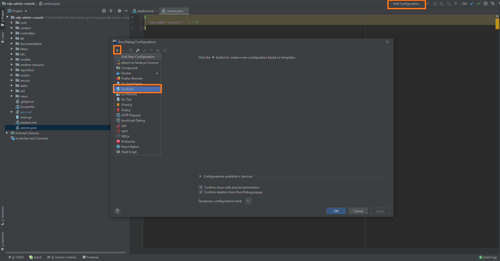
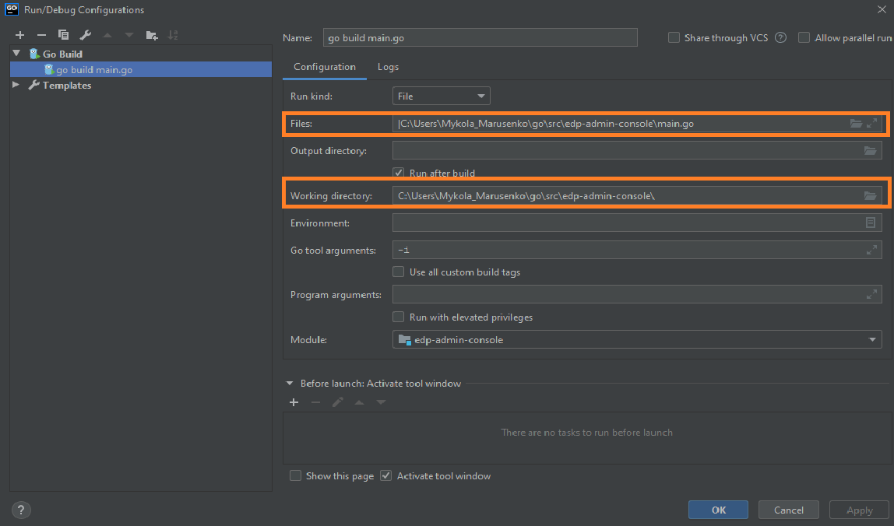
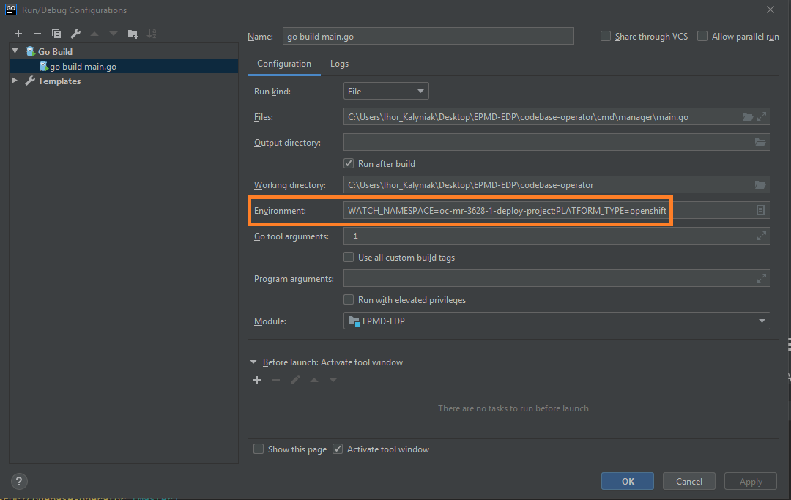
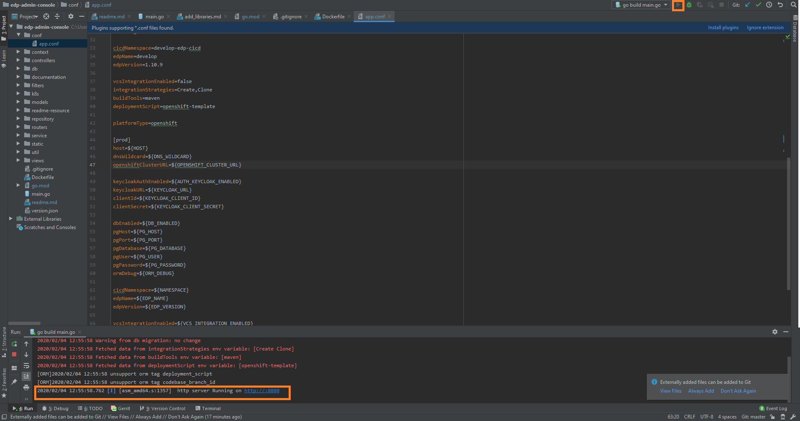

# EDP Jenkins Operator

## Overview

Jenkins operator creates, deploys and manages the EDP Jenkins instance, which is equipped with the necessary plugins, on Kubernetes and OpenShift.  

There is an ability to customize the Jenkins instance and to check changes during the application creation.

### Prerequisites
1. Linux machine or Windows Subsystem for Linux instance with [kubectl](https://kubernetes.io/docs/tasks/tools/install-kubectl/) installed with an authorized access to the cluster;
2. Admin space is deployed by following one of the instructions: [edp-install-openshift](https://github.com/epmd-edp/edp-install/blob/master/documentation/openshift_install.md#admin-space) or [edp-install-kubernetes](https://github.com/epmd-edp/edp-install/blob/master/documentation/kubernetes_install.md#admin-space).

### Installation
* Go to the [releases](https://github.com/epmd-edp/jenkins-operator/releases) page of this repository, choose a version, download an archive, and unzip it;

_**NOTE:** It is highly recommended to use the latest released version._

* Go to the unzipped directory and apply all files with the Custom Resource Definitions resource:
```bash
for file in $(ls deploy/crds/*_crd.yaml); do kubectl apply -f $file; done
```

* Deploy operator:
```bash
kubectl patch -n <edp_cicd_project> -f deploy/operator.yaml --local=true --patch='{"spec":{"template":{"spec":{"containers":[{"image":"epamedp/jenkins-operator:<operator_version>", "name":"jenkins-operator-v2", "env": [{"name":"WATCH_NAMESPACE", "value":"<edp_cicd_project>"}, {"name":"PLATFORM_TYPE","value":"<platform>"}]}]}}}}' -o yaml | kubectl -n <edp_cicd_project> apply -f -
```

- _<operator_version> - a selected release version;_

- _<edp_cicd_project> - a namespace or a project name (in case of OpenSift) that is created by one of the instructions: [edp-install-openshift](https://github.com/epmd-edp/edp-install/blob/master/documentation/openshift_install.md#install-edp) or [edp-install-kubernetes](https://github.com/epmd-edp/edp-install/blob/master/documentation/kubernetes_install.md#install-edp);_

- _<platform_type> - a platform type that can be "kubernetes" or "openshift"_.

* Check the <edp_cicd_project> namespace that should contain Deployment with your operator in a running status.

---

In order to apply the necessary customization, get acquainted with the following sections:

* [Add Jenkins Slave](documentation/add-jenkins-slave.md) 
* [Add Job Provision](documentation/add-job-provision.md)
* [GitLab Integration](documentation/gitlab-integration.md)
* [GitHub Integration](documentation/github-integration.md)
* [Customize CD Pipeline](documentation/customize-deploy-pipeline.md) 

## Local deployment
### Requirements:
* Go version (great than 1.13)

_**NOTE**: Make sure that environment variable GOPATH and GOROOT are added in PATH:_
```
export GOPATH=C:\Users\<<username>>\go
export GOROOT=C:\Go
```

* Configured access to the VCS (see [Gerrit Setup for Developer](https://kb.epam.com/display/EPMDEDP/Gerrit+Setup+for+Developer))
* GoLand Intellij Idea or another IDE

### Deploy:
1. Clone repository
2. Open folder in GoLand Intellij Idea and select Add Configuration → Go Build
 
3. Set the path to the main.go file in Files field and path to the Working directory for operator
 
4. Specify a platform name (OpenShift/Kubernetes) and selected namespace in Environment tab 
 
5. Run 'go build main.go' (Shift+F10)
 
6. Check the operator logs in output console 
```
{"level":"info","ts":1580892926.0925794,"logger":"cmd","msg":"Go OS/Arch: windows/amd64"}
{"level":"info","ts":1580892926.0925794,"logger":"cmd","msg":"Version of operator-sdk: v0.8.0+git"}
{"level":"info","ts":1580892926.0945308,"logger":"leader","msg":"Trying to become the leader."}
{"level":"info","ts":1580892926.0945308,"logger":"leader","msg":"Skipping leader election; not running in a cluster."}
{"level":"info","ts":1580892928.177485,"logger":"cmd","msg":"Registering Components."}
{"level":"info","ts":1580892928.1784606,"logger":"cmd","msg":"Registering External Components."}
{"level":"info","ts":1580892928.1794367,"logger":"kubebuilder.controller","msg":"Starting EventSource","controller":"jenkins-controller","source":"kind source: /, Kind="}
{"level":"info","ts":1580892928.1813889,"logger":"kubebuilder.controller","msg":"Starting EventSource","controller":"jenkins-folder-controller","source":"kind source: /, Kind="}
{"level":"info","ts":1580892928.182365,"logger":"kubebuilder.controller","msg":"Starting EventSource","controller":"jenkins-job-controller","source":"kind source: /, Kind="}
```

### Exceptional Cases
After starting Go build process you see the following error: 
```
go: finding github.com/openshift/api v3.9.0
go: finding github.com/openshift/client-go v3.9.0
go: errors parsing go.mod:
C:\Users\<<username>>\Desktop\EDP\edp-admin-console\go.mod:36: require github.com/openshift/api: version "v3.9.0" invalid: unknown revision v3.9.0

Compilation finished with exit code 1
```

This problem can resolve by manual update go dependency using golang command:
```
go get github.com/openshift/api@v3.9.0
```

In case if you have error: *Unauthorized* error in logs, check you current *KUBECONFIG* path.
You can specify another *KUBECONFIG* path before running operator in Go build configuration (see point 4):
```
WATCH_NAMESPACE=test-deploy-platform;PLATFORM_TYPE=openshift;KUBECONFIG=C:\Users\<<username>>\.kube\kubeconfig
```